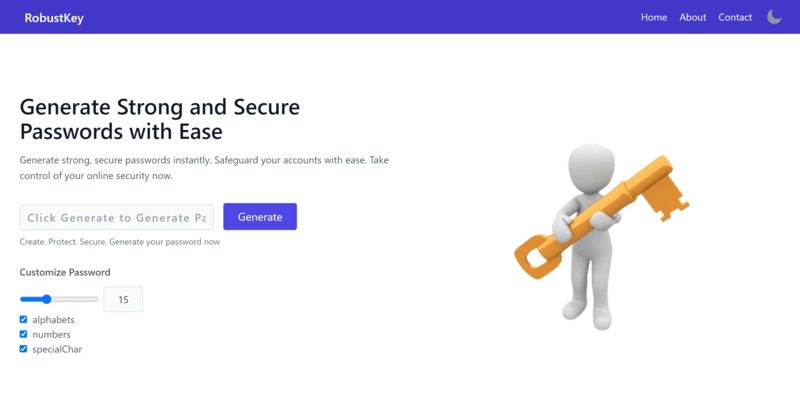

<h1 align="center">RobustKey🚀</h1>



## 💻 Tech Stack
- **ReactJs**
- **Tailwind CSS**
- **vite**

### 📖

## 🔐 **RobustKey** - Empowering Password Generation for Everyone

[RobustKey](https://amanrajrana.github.io/RobustKey-PasswordGenerator) is not just a password generator; it's an open invitation for passionate contributors like you! Built with React and Tailwind CSS, this open-source project aims to simplify password creation while fostering a vibrant community of developers.


### 🚀 **Why Contribute?**

- **Learn and Grow:** RobustKey offers an excellent opportunity to dive into React and Tailwind CSS, perfect for honing your web development skills.
- **Make an Impact:** Your contributions directly enhance online security by improving password generation for users worldwide.
- **Collaborative Spirit:** Join a welcoming community of developers, share ideas, and work together to build something amazing.

### 🛠️ **How to Contribute?**

Ready to get started? It's as easy as 1-2-3:

1. Explore our open issues and find a task that sparks your interest.
2. Fork the repository and make your enhancements.
3. Create a pull request, and our friendly maintainers will review and merge your changes.

### 🤝 **Join Our Community**

RobustKey welcomes contributors of all levels. Whether you're a seasoned developer or just starting, we value your input. Join our community today, and together, let's fortify online security one password at a time! 🌐"


## Setup Locally
**Prerequisite**
- 1. NodeJs
- 2. Git

1. Clone the project

    ```
    git clone https://github.com/amanrajrana/RobustKey-PasswordGenerator.git
    ```

2. Go to the project directory
    ```
    cd RobustKey-PasswordGenerator
    ```

3. Install Dependencies
    ```
    npm install
    ```

4. Start App
    ```
    npm run dev
    ```
## Our Contributors

We want to extend our heartfelt thanks to all the contributors for their valuable contributions to this project. Your hard work, dedication, and support have been instrumental to the project's success.


## Authors
**_Aman Raj Rana_**

[](https://www.linkedin.com/in/amanrajrana)
[](https://github.com/amanrajrana)
